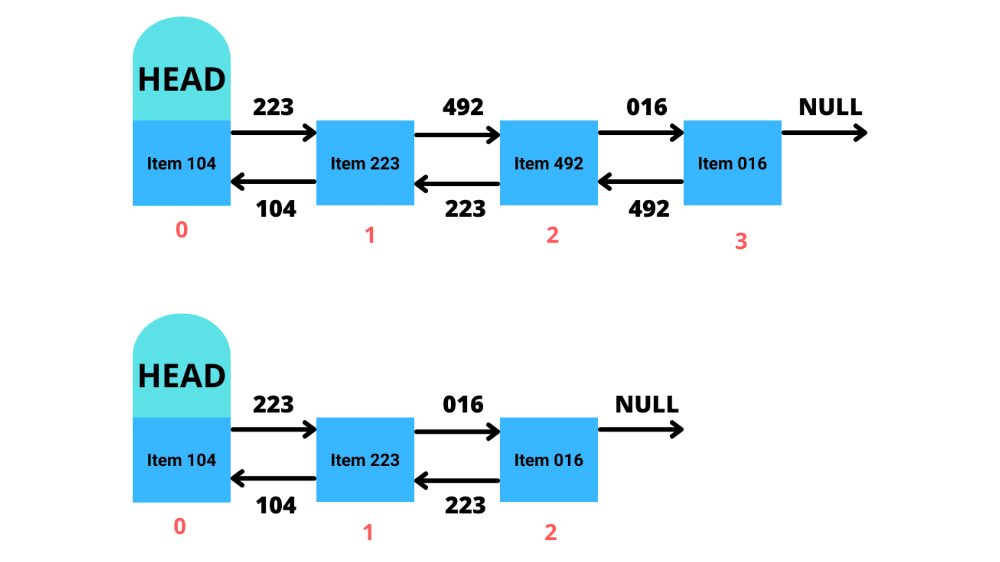

# Lists no Java

As Lists, como deve imaginar, é uma coleção ordenada de elementos. Esses elementos podem variar em tipos de dados diferentes, como String, int, long, boolean e classes.

## Iniciando com arrays

Criamos uma array usando desse jeito:

```java
String[] strArr = new String[3];

strArr[0] = "Hello World"
```

Para definir que o tipo da variável é uma array, é preciso adicionar os colchetes após o type, no exemplo fizemos uma array de Strings com `String[]`, mas poderia ser qualquer outro tipo.

Após a declaração da variável, criamos a array com o `new String[3]`, o número entre os colchetes é a largura da array, em outras palavras, quantos elementos cabem nessa array.

**OBS.:** Uma forma alternativa, caso você já tenha os elementos que irá adicionar à array, seria:

```java
int[] intArr = {4, 8, 6, 4};
```

Isso criaria uma array com 4 de largura com os elementos dados nessas mesmas posições.

Para acessar os elementos, ou como chamamos, o **index** de uma array, chamamos a variável com o index que queremos entre colchetes (`strArr[0]`).

Desse jeito, é como se ao chamar `strArr[0]`, eu estivesse chamando outra variável, então podemos manipular esse valor como bem entendermos. no exemplo dado, estamos definindo o index 0 como "Hello World". Qualquer outro valor não definido manualmente será `null`.

```java
strArr[0] // "Hello World"
strArr[1] // null
strArr[2] // null
```

Talvez você tenha notado que ao criar a array, definimos a largura (ou dimensão) dela como 3 espaços, mas no exemplo só fomos até o index 2. Isso é porque a programação usa algo chamado **zero-based numbering** (também já ouvi ser chamado de **zero-index**), significa que o primeiro index não é o 1, e sim o 0. A largura da array é de 3, mas o primeiro index é o 0, então se fizer os cálculos, o ultimo item da array vai ser largura - 1, ou seja, 2.

Você também pode acessar a largura da array com o atributo `length`, que retorna a largura em int.

Você pode usar isso para iterar pela array e manipular todos os elementos, como por exemplo:

```java
// isso leria mais ou menos como
// variável "i" do tipo int é igual a 0, enquanto "i" for menor que largura da array strArr, adicione 1 ao "i"
for (int i = 0; i < strArr.length; i++) {
    System.out.println(strArr[i]);
    }
}
```

Caso você tente acessar um index fora da largura da array, você vai receber uma excessão `IndexOutOfBoundsException`

O problema das arrays tradicionais é que você está preso à largura que você escolheu, você até poderia criar uma nova array maior e passar esses elementos para ela, mas isso seria trabalhoso e repetitivo toda vez que você precisasse de mais espaço.

Além disso, não podemos acessar apenas as posições que estão ocupadas, recebemos a largura total da array sempre que usamos `length`.

É agora que entramos nas **Lists**

## ArrayList

O **ArrayList** é um tipo de coleção implementado da interface **List**, seu intuito é ser uma array dinâmica, e o limite de sua largura é a memória do seu PC. Além disso, as Lists apresentam novas facilidades como organizadores, procuradoes, filtros (através de streams) e [outros](https://docs.oracle.com/javase/8/docs/api/java/util/List.html "Interface List<E>").

**ArrayList** também usa arrays por baixo dos panos, digamos que ao criar uma ArrayList, você comece com 10 de largura. Você já preencheu esses 10 espaços e precisa adicionar mais 1, ao pedir para classe adicionar mais 1, a classe vai realocar um espaço na memória com mais espaço e copiar todos os elementos para esse novo local na memória.

A classe tem suas vantagens e desvantagens que iremos discutir em um [tópico separado](#arraylist-vs-linkedlist "ArrayList vs LinkedList").

Então, vamos lá! A classe vem do package **java.util.ArrayList**, assim como todas as outras classes que vamos usar nesse documento.

Para criar uma **ArrayList**, fazemos assim:

```java
List<String> arrList = new ArrayList<>();
```

Ao declarar a variável, usamos o tipo `List<String>`. Essas setas envolvendo o tipo String (realmente esqueci o nome desses símbolos enquanto escrevo isso) é o que chamamos de **Generics**, talvez você possa ter visto isso como `<T>`. Para resumir, o tipo passado nesse Generic será o tipo dos elementos da **ArrayList** (como se você estivesse escrevendo String[]), lembrando que os elementos também podem ser `null`.

Mais sobre Generics no [DevMedia](https://www.devmedia.com.br/usando-generics-em-java/28981 "Usando Generics em Java").

Talvez você tenha estranhado que estamos definindo o tipo da variavel como **List** ao invés de **ArrayList**. Também falaremos disso em um [tópico separado](#arraylist-vs-linkedlist "ArrayList vs LinkedList").

Diferente das arrays tradicionais, iremos acessar e manipular nossos elementos através de métodos.

```java
arrList.add("Hello World"); // Adiciona um elemento ao final da array
arrList.get(0); // Hello World
arrList.set(0, "How have you been?"); // vai definir o valor do index dado com o valor que foi passado
arrList.get(0); // How have you been?
arrList.add("Eu serei removido");
arrList.remove(1); // Remove o elemento do index dado
```

Você também pode acessar a largura da **ArrayList** através do método `size()`, e diferente das arrays tradicionais, ele vai retornar a quantidade de posições ocupadas, ao invés de todas as posições.

Existem outros métodos como `replaceAll()`, `contains()`, `clear()`, entre outros. Sinta-se livre para explorar a [documentação](https://docs.oracle.com/javase/8/docs/api/java/util/List.html "Interface List<E>") e descobrir novos métodos e utilidades.

## LinkedList
**LinkedList** usa os mesmos métodos da classe **ArrayList** pois ambos são implementações da interface **List**, o que muda entre um e outro é como ambos funcionam.

(Espero que entendam minhas ilustrações, estou bem longe de ser um designer ksks)
 

Como podemos ver, uma **ArrayList** tem seu elemento posicionado por um index, e é diretamente por esse index que acessamos esse elemento.

 

Já no LinkedList seguimos uma corrente de elementos. O elemento com o HEAD é o primeiro elemento dessa lista, e todos os elementos sabem quem é seu elemento sucessor e antecessor, e o último elemento tem `null` como seu sucessor.

Diferente do ArrayList que acessamos o elemento correspondente ao index, apesar de acessarmos um elemento através de um index, na verdade ele está iterando entre os elementos até chegar na posição que desejamos.

É um loop de o elemento atual acessando o seu próximo elemento até chegarmos na posição que pedimos. Mas todo esse processo parece ser lento, então qual é a vantagem disso?

## ArrayList vs LinkedList

Ambos tem seus casos de uso.

Apesar de **ArrayList** ser de fácil acesso aos elementos, ele tem um desempenho não muito satisfatório quando falamos de removeção de elementos.

Digamos que precisamos remover o elemento correspondente ao index 2 da nossa **ArrayList**.

 

Para não deixar um index vazio no meio da Array, a classe vai começar a reposicionar os elementos para preencher esse espaço vazio sem alterar sua ordem.

Esse processo em uma **ArrayList** grande vai ser bem custoso, e quanto menor for o index, mais reposicionamentos a **ArrayList** vai ter que fazer.

Já na **LinkedList**, esse processo é muito mais simples.

 

Baseado na imagem, o que acontece é que quando removemos o elemento na posição 2 da **LinkedList***, ele vai chegar na posição anterior (posição 1) e falar: "Seu sucessor não é mais o Item 492 (posição 2), agora é o Item 016 (posição 3)". A mesma coisa é feita na posição seguinte do elemento removido, avisando que seu elemento antecessor foi mudado.

Desse jeito, podemos fazer remoções e adições de elementos nas posições menores. Mas esse processo pode ser menos eficiente de acordo que as posições alteradas são mais altas, já que como vimos, o **LinkedList** precisa iterar por cada elemento até chegar na posição desejada.

Então se você não vai remoções ou adições de elementos em posições baixas na lista, use **ArrayList** por seu fácil acesso aos elementos.

Caso você precisa fazer remoções e adições de elementos em posições baixas na lista, então é recomendado usar **LinkedList** por sua fácil manipulação de elementos.

Mas caso você não esteja certo, você pode testar os 2 sem fazer muita manutenção usando **polimorfismo**.

Como vimos mais cedo, declaramos uma variável como **List** ao invés de **ArrayList** ou **LinkedList** pois ambos compartilham dos mesmos métodos da interface **List**. Em casos assim, sempre é uma boa prática usar o tipo mais genérico possível para cada caso, pois assim você poupa dores de cabeça mais na frente.

Java saber se a lista é **ArrayList** ou **LinkedList** não importa, o que importa é que as duas fazem as mesmas operações e retornam os mesmos resultados, apenas fazem isso de jeitos diferentes.

Então caso você sinta que seu processo está meio lento em relação as listas, tente mudar para outro tipo de lista.