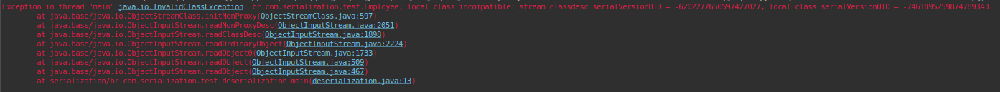

# Serialização no Java

A Serialização é uma técnica que permite transformar o estado de um objeto num fluxo de bytes. O objeto serializado pode ser gravado num arquivo de dados, recuperado do arquivo e desserializado para recriar o objeto na memória.

Esse processo de serialização é bastante utilizado em sistemas distribuídos (computadores independentes conectados por uma rede) e na persistência de dados (manter dados além da duração da execução do programa). com essa transformação, é possível enviar o objeto por uma rede (através de Sockets), ou salvá-lo num arquivo ou num banco de dados.

Fonte: [DevMedia](https://www.devmedia.com.br/serializacao-de-objetos-em-java/23413 "Serialização de objetos em java")

## java.io.ObjectOutputStream

**ObjectOutputStream** irá serializar um objeto,ou seja, transformar um objeto num fluxo de bytes.


**ObjectOutputStream** recebe um **OutputStream** como argumento do constructor.

```java
// Exemplo de um Output com um arquivo:
ObjectOutputStream oos = new ObjectOutputStream(new FileOutputStream("example.ser");
```

A classe **ObjectOutputStream** disponibiliza vários métodos de escrita de dados mais específicos, como `writeChars(String str)`, `writeLong(long number)` e [etc](https://docs.oracle.com/javase/7/docs/api/java/io/ObjectOutputStream.html "Class ObjectOutputStream"). Mas o mais genérico seria o `writeObject(Object obj)`, que também suporta classes.`
Esses métodos irão serializar o objeto passado como argumento no Stream do **ObjectOutputStream**.

```java
oos.writeObject("Lorem Ipsum");
```

Para serializar uma classe, existe uma condição. É necessário que a classe implemente a interface **Serializable**.

[Exemplo de classe serializável](src/br/com/serialization/test/Employee.java "Employee.java")

assim como qualquer outro Stream, é preciso fechar depois de usar.

```java
oos.close();
```

## java.io.ObjectInputStream
**ObjectInputStream** irá desserializar um fluxo de bytes, ou seja, transformar um fluxo de bytes num objeto.

**ObjectInputStream** recebe um **InputStream** como argumento do constructor.

```java
// Exemplo de um Input com um arquivo
ObjectInputStream ois = new ObjectInputStream(new FileOutputStream("example.ser");

// Exemplo de um Input com um Socket
Socket sock = new Socket("localhost", 15000);

ObjectInputStream ois2 = new ObjectInputStream(sock.getInputStream());
```

Assim como no **ObjectOutputStream**, **ObjectInputStream** também tem seus [métodos de leitura mais específicos](https://docs.oracle.com/javase/7/docs/api/java/io/ObjectInputStream.html "Class ObjectInputStream"), mas o mais genérico é o `readObject()`.

Digamos que serializamos uma classe Client no arquivo "example.ser".

Ao desserializar essa classe para uma variável, é necessário usar um type casting para dizer que esse Object é um Client

```java
Client clint = (Client) ios.readObject();
client.getName(); //Rick Astley
```

Entretanto, esse método joga uma exceção checada (Checked Exceptions) `ClassNotFoundException`, então é necessário adicionar um `throws` no método em que ela está sendo usada, ou envolver com um try/catch

Assim como todo Stream, devemos fechar após o uso.

```java
ios.close();
```

## serialVersionUID

Caso você tenha ficado curioso(a) e decidiu bisbilhotar algumas classes do Java, talvez possa ter notado que em algumas classes do Java, há um atributo chamado **serialVersionUID** com um número bem estranho.

Esse atributo é um número de versionamento da classe na hora de serializar e desserializar. Para o java saber se essa classe que você está desserializando é igual a classe que foi serializada, ele compara o tal **serialVersionUID** das duas, e isso pode ser um problema caso você omita esse atributo ao criar sua própria classe Serializable.

Caso você não defina esse valor você mesmo, o Java vai usar um valor padrão na memória. Então se você serializar uma classe Client, por exemplo, e depois adicionar o método `getHistoricoDeVisitas()` a essa classe, e desserializar a classe sem esse método, o Java vai lançar a exceção `InvalidClassException` por incompatibilidade entre as classes.



Podemos ver na primeira linha a parte que mostra a incompatibilidade entre as versões:

`local class incompatible: stream classdesc serialVersionUID = -6202277650597427027, local class serialVersionUID = -7461895259874789343`

Isso é porque assim que você adiciona ou remove qualquer atributo ou método na classe, Java vai automaticamente mudar o **serialVersionUID** para outra versão. Mas isso pode ser evitado.

```java
class Client implements Serializable {
	// A IDE que você usar provavelmente vai te ajudar a implementar esse atributo
	private static final long serialVersionUID = 1L; 
	
	// Resto do código
}
```

Ao manter o mesmo **serialVersionUID**, o Java não vai reclamar de nenhuma imcompatibilidade, então é recomendado que você o mude apenas quando mudar algo que pode quebrar em usos antigos, como por exemplo a remoção de um método.

## Hierarquia e Agregações

Quando temos uma classe que precisa ser serializada, mas faz parte de uma hierarquia, a classe de mais alto nivel deve implementar a interface **Serializable**. Desse modo, todos os seus filhos irão ser serializáveis.

Outra questão é que, caso você tenha uma classe, que recebe outra classe criada como atributo, você irá receber a exceção `NotSerializableException`.

Há duas maneiras de evitar isso.

1. você implementa a interface Serializable nessa classe.

2. vocẽ usa a keyword `transient` nessa classe.

```java
class Client implements Serializable {
	private transient Address address;
	
	// Resto do código
}
```

Essa keyword faz com que o atributo não seja serializado, ou seja, ele vai ser salvo como `null`. Por isso deve ser usado apenas quando esse atributo não é essencial.
